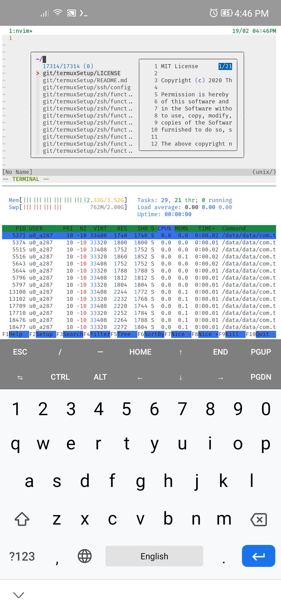

# termux setup

## Demo (Vsmart live 4, android 10, light theme)

## Check list

**Note: you should edit script for your custom**

- [ ] Run step1 `./step1.sh`
- [ ] Run step2 `./step2.sh`
      **Note your old file saved as ~/backupDotfile**

- [ ] **Edit file ~/.gitconfig** `nvim ~/.gitconfig` -by default: gitconfig using my email address-

## Contributing workflow

Here’s how we suggest you go about proposing a change to this project:

1. [Fork this project][fork] to your account.
2. [Create a branch][branch] for the change you intend to make.
3. Make your changes to your fork.
4. [Send a pull request][pr] from your fork’s branch to our `master` branch.

[fork]: https://help.github.com/articles/fork-a-repo/
[branch]: https://help.github.com/articles/creating-and-deleting-branches-within-your-repository
[pr]: https://help.github.com/articles/using-pull-requests/
